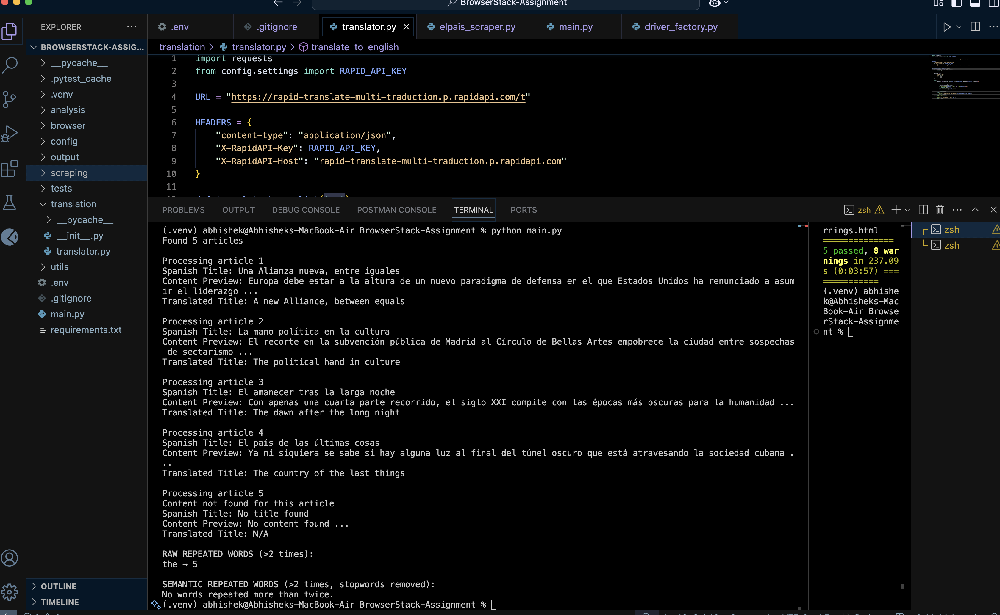
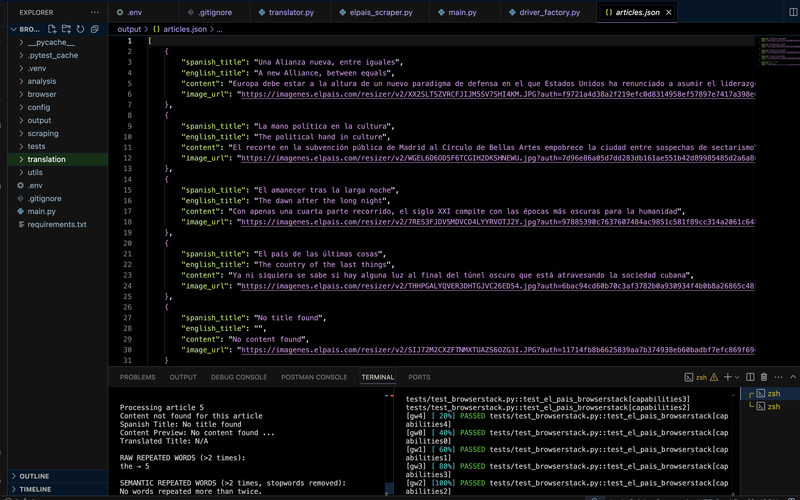
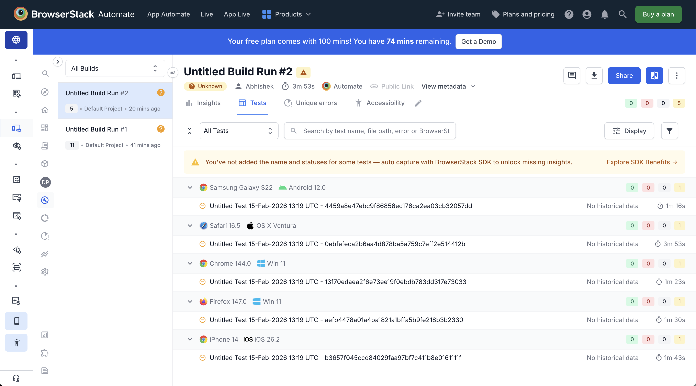
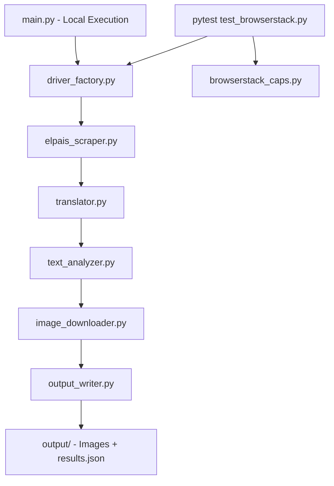

# BrowserStack-Customer_Engineer
## Selenium Technical Assignment


## Overview

This project showcases a comprehensive Selenium-based automation solution for web scraping, API integration, text processing, and cross-browser testing. It fulfills the technical assignment by automating interactions with El País, a leading Spanish news outlet.

### Key Capabilities

- **Navigation & Scraping**: Accesses the El País website, ensures Spanish language display, navigates to the Opinion section, and extracts the first five articles (titles, content, and cover images).
- **Translation**: Translates article titles from Spanish to English using a secure API integration.
- **Text Analysis**: Performs frequency analysis on translated titles, identifying words repeated more than twice, with enhancements for semantic insights (e.g., stopword removal).
- **Image Handling**: Downloads and saves article cover images locally when available.
- **Cross-Browser Testing**: Runs locally for development and in parallel on BrowserStack across desktop and mobile browsers for validation.

The solution emphasizes modularity, fault tolerance, and separation of concerns, making it reusable and maintainable. It goes beyond requirements with semantic analysis and parallel testing via Pytest.

### Highlights

- **Modular Architecture**: Clean separation of scraping, translation, analysis, and utilities for easy extension.
- **Dual Execution Modes**: Local runs for quick iteration; BrowserStack for scalable, parallel cloud testing.
- **Robustness**: Explicit Selenium waits, error handling for missing elements/images, and secure credential management.
- **Enhancements**: Raw frequency counting (per assignment) + semantic processing for deeper insights.
- **Testing Integration**: Pytest with pytest-xdist for efficient parallel execution.

## Tech Stack

- **Core Language**: Python 3.8+
- **Automation**: Selenium WebDriver
- **Testing**: Pytest, pytest-xdist (parallel execution)
- **Cloud Testing**: BrowserStack Automate
- **HTTP & APIs**: Requests (for downloads and API calls)
- **Configuration**: Python-dotenv (.env files)
- **Text Processing**: Regular Expressions, Collections (Counter)
- **Translation**: Deep Translator API (fallback to other providers via config)

## Project Structure

```
BrowserStack-Assignment/
├── main.py                 # Entry point for local execution
├── requirements.txt        # Python dependencies
├── pyproject.toml          # Pytest configuration
├── .env                    # Environment variables (not committed)
├── .gitignore              # Git exclusions
│
├── analysis/               # Text processing logic
│   └── text_analyzer.py
│
├── browser/                # Driver management
│   └── driver_factory.py
│
├── config/                 # Configuration files
│   ├── browserstack_caps.py  # BrowserStack capabilities
│   └── settings.py          # App settings (URLs, constants)
│
├── scraping/               # Web extraction
│   └── elpais_scraper.py
│
├── translation/            # API integration
│   └── translator.py
│
├── utils/                  # Helper functions
│   ├── image_downloader.py
│   └── output_writer.py
│
├── tests/                  # Test suite
│   └── test_browserstack.py  # BrowserStack parallel tests
│
└── output/                 # Generated outputs (images, JSON results)
```

## Assignment Requirements Covered

### Web Scraping

- Navigate to El País and verify Spanish content (via language headers and checks).
- Access the Opinion section (https://elpais.com/opinion/).
- Extract the first five articles, printing titles and content in Spanish.
- Download and save cover images (if available) to `output/`.
- Handles dynamic JS loading with explicit Selenium waits for reliability.

### Translation

- Translates Spanish titles to English using a configurable API (e.g., Deep Translator).
- Prints translated headers.
- Securely manages API keys via environment variables to prevent exposure.

### Text Analysis

- **Raw Frequency (Core Requirement)**: Scans combined translated headers for words repeated >2 times, outputting counts.
- **Semantic Enhancement**: Normalizes text (lowercase, stemming), removes stopwords, and provides cleaner insights.

### Cross-Browser Testing

- Local validation ensures core functionality.
- Parallel execution on BrowserStack across 5 configurations (see table below).

| # | Type    | Browser | OS / Device                    |
|---|---------|---------|--------------------------------|
| 1 | Desktop | Chrome  | Windows 11                     |
| 2 | Desktop | Firefox | Windows 11                     |
| 3 | Desktop | Safari  | macOS Ventura                  |
| 4 | Mobile  | Safari  | iPhone 14                      |
| 5 | Mobile  | Chrome  | Samsung Galaxy S22 (Android 12)|

## Setup Instructions

### 1. Clone the Repository

```bash
git clone https://github.com/AbhishekS31/BrowserStack-CE-Assignment-El-pais-Scrapper.git
cd BrowserStack-Assignment
```

### 2. Create a Virtual Environment

**macOS/Linux:**
```bash
python -m venv .venv
source .venv/bin/activate
```

**Windows:**
```bash
python -m venv .venv
.venv\Scripts\activate
```

### 3. Install Dependencies

```bash
pip install -r requirements.txt
```

### 4. Configure Environment

Copy `.env.example` to `.env` (create if missing) and add your keys:

```
RAPID_API_KEY=your_translation_api_key
BROWSERSTACK_USERNAME=your_browserstack_username
BROWSERSTACK_ACCESS_KEY=your_browserstack_access_key
```

- **Translation API**: Sign up at DeepL or similar.
- **BrowserStack**: Get credentials from Automate Dashboard.

## Usage

### Running Locally

Validate the full pipeline (scraping → translation → analysis → output):

```bash
python main.py
```

- Launches a local browser (Chrome by default).
- Scrapes articles, translates, analyzes, and saves to `output/`.

### Running on BrowserStack

Execute parallel tests across configured browsers:

```bash
pytest tests/test_browserstack.py -n 5 -v
```

- Uses pytest-xdist for 5 parallel workers.
- Logs sessions to BrowserStack dashboard for review.

## Output

### Console Output

- Spanish article details (titles, truncated content).
- English translated titles.
- Raw repeated words table (e.g., `| Word    | Count |`).
- Semantic analysis summary.

### Generated Files

- **Images**: Cover photos saved as `article_1.jpg`, etc., in `output/`.
- **JSON Results**: `output/results.json` with structured data (articles, translations, analysis).

## Results

### Local Execution

**Local Run Screenshot**





### BrowserStack Dashboard


**Session Links**: [View BrowserStack Build](https://automate.browserstack.com/projects/Default+Project/builds/Untitled+Build+Run/2?tab=tests&testListView=spec&public_token=4cb164f18b3c9f83d3ad97d7397ebbc3beffec72881f9bc551a0357b96287a78)

Parallel runs complete in ~2-3 minutes; videos/logs available for each browser.

## Design Decisions

This solution prioritizes maintainability, reliability, and extensibility. Key choices include:

- **Separation of Execution Modes (Local vs. BrowserStack)**
    Local runs (`main.py`) focus on development; cloud tests (pytest) validate compatibility. This keeps core logic reusable without environment-specific pollution.

- **Modular Architecture**
    Dedicated modules (e.g., `scraping/`, `translation/`) enforce separation of concerns, easing testing and future additions like new APIs.

- **Shared Automation Pipeline**
    Identical scraping logic across modes ensures consistency and reduces duplication.

- **Explicit Wait Strategy**
    Uses Selenium's `WebDriverWait` for dynamic elements, minimizing flakiness and improving speed over `time.sleep()`.

- **Environment-Based Configuration**
    `.env` files handle secrets, preventing commits to Git and enabling easy env switches.

- **Fault-Tolerant Image Handling**
    Optional downloads with try-catch; failures don't halt the pipeline.

- **Dual Analysis Strategy**
    Raw counts meet requirements; semantic enhancements (stopwords, normalization) add value without overcomplicating.

- **Parallel Execution via Pytest**
    `pytest-xdist` scales tests efficiently, mirroring production CI/CD practices.

## Architecture Diagram



By Abhishek Singh